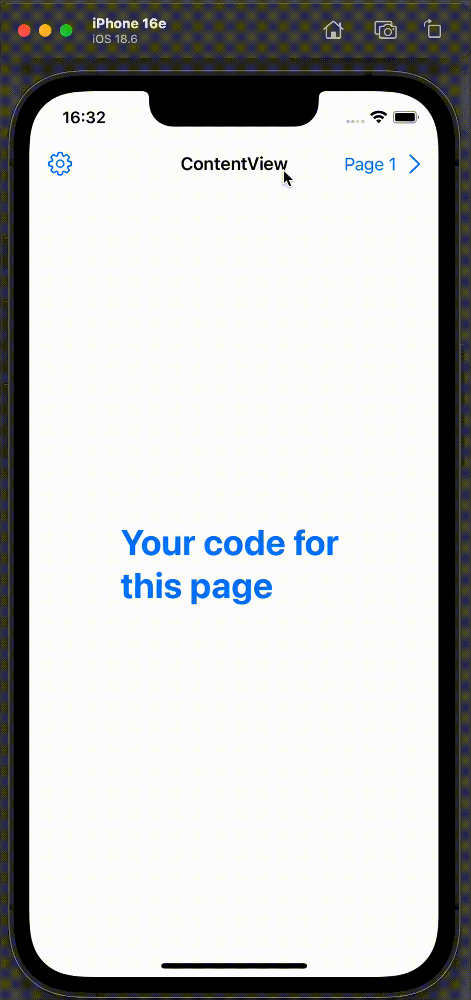

# NavigationsStackTemplate

This project demonstrates the use of SwiftUI's `NavigationStack` to create a dynamic and programmatically controlled navigation flow. The app includes multiple views, each representing a specific page, and allows navigation between them using a shared navigation path.

## Features

- **Dynamic Navigation**: Uses a `@State` variable to manage the navigation path.
- **Reusable Components**: Includes a reusable `NavigationButton` component for consistent navigation logic.
- **Multiple Views**: Implements four distinct views (`Page1View_`, `Page2View_`, `Page3View_`, and `SettingsView_`).
- **Toolbar Integration**: Adds navigation buttons to the toolbar for seamless navigation.
- **Environment Awareness**: Detects the current color scheme (light/dark mode) using `@Environment`.

## Code Structure

### `AppView` Enum

Defines the possible destinations in the navigation stack:
- `page1View`
- `page2View`
- `page3View`
- `settings`

### `ContentView`

The main entry point of the app. It includes:
- A `NavigationStack` to manage the navigation hierarchy.
- A `ZStack` with placeholder content.
- A toolbar with navigation buttons for `Page 1` and `Settings`.
- A `navigationDestination` modifier to define the destinations for each `AppView` case.

### `NavigationButton`

A reusable SwiftUI `View` for navigation. It:
- Accepts a binding to the navigation path.
- Appends the specified destination to the path when tapped.
- Displays an optional title and an icon.

### Individual Views

#### `Page1View_`
- Represents the first page in the navigation stack.
- Includes a toolbar button to navigate to `Page 2`.

#### `Page2View_`
- Represents the second page in the navigation stack.
- Includes a toolbar button to navigate to `Page 3`.

#### `Page3View_`
- Represents the third page in the navigation stack.
- Includes a toolbar button to clear the navigation path and return to the root.

#### `SettingsView_`
- Represents the settings page.
- Placeholder content for future customization.

### `ContentView_Previews`

Provides a preview of the `ContentView` for development purposes.

## How It Works

1. **NavigationStack**: The `NavigationStack` manages the navigation hierarchy using the `path` state variable.
2. **Dynamic Path**: The `path` variable is updated programmatically to navigate between views.
3. **Reusable Buttons**: The `NavigationButton` component simplifies navigation logic and ensures consistency.
4. **Toolbar Integration**: Toolbar buttons provide quick access to specific destinations.

## Requirements

- **Xcode**: Version 14 or later.
- **Swift**: Version 5.7 or later.
- **macOS**: Version 12.0 or later.

## How to Run

1. Clone the repository to your local machine.
2. Open the project in Xcode.
3. Build and run the app on a simulator or a physical device.

## Future Enhancements

- Add more pages and navigation logic.
- Customize the `SettingsView_` with user preferences.
- Implement data persistence for the navigation state.

## License

This project is licensed under the Apache License. See the `LICENSE` file for details.
